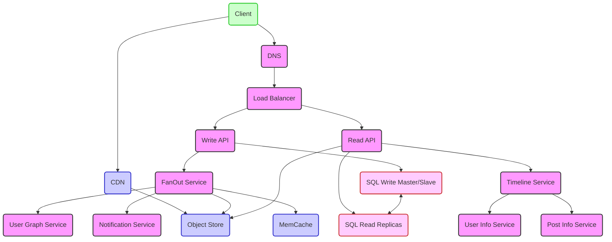

# prjctr-07 Highload Applications Architecture

Here's a comprehensive system design summary for the Instagram-like service, integrating diagram, definitions, requirements, constraints, and assumptions:

## System Design Summary for Instagram-like Service

**Requirements:**
- Users can post videos or photos.
- Users can view a feed consisting of content from friends and recommended accounts.
- Users can comment on posts.
- Users can like posts.
- The service must have high availability.

**Constraints and Assumptions:**
- Traffic is not evenly distributed.
- Post uploads and distribution should be fast, especially for users with many followers.
- 1 billion monthly active users.
- Read/write ratio is 100:1.
- 5 billion daily posts, leading to 150 billion monthly posts.
- Average fan-out per post is 100 followers.
- 15 trillion fan-outs per month.
- Users read about 100 posts daily, amounting to 100 billion reads per month.
- 1 billion writes per month.
- 10:1 ratio of pictures to videos.
- Average post size is 15MB, leading to 15PB of new posts monthly.
- In three years, the total content would be around 600PB.
- The system should be optimized for fast reads, given the heavy read load.

**High-Level Design:**
- **Client**: Interfaces with the system for various user actions.
- **DNS**: Resolves the service's domain to an IP address.
- **CDN**: Efficiently serves static content to users.
- **Load Balancer**: Directs incoming traffic to different services to balance the load.
- **Write API**: Handles the creation of new posts.
- **Read API**: Retrieves posts for user timelines.
- **Timeline Service**: Compiles the posts for the user's timeline.
- **MemCache**: Caches data to improve read performance.
- **FanOut Service**: Distributes posts to followers.
- **SQL Master/Slave**: Manages write operations and replicates data to read replicas.
- **SQL Read Replicas**: Serves read operations to distribute database load.
- **Object Store**: Stores user-generated content like photos and videos.
- **User Info Service**: Manages user-specific data like profiles.
- **Post Info Service**: Manages data related to posts.
- **User Graph Service**: Manages the social graph and connections between users.
- **Notification Service**: Handles sending notifications to users.

**Mermaid Diagram:**

## Possible Improvements:
1. **Caching Strategy**: Use distributed caching instead of MemCache to handle more data.
2. **Database Sharding**: Consider database sharding to distribute the load across multiple databases, rather than relying solely on master/slave replication.
3. **Data Partitioning in Object Store**: Implement data partitioning strategies like range-based or hash-based partitioning for the Object Store.
4. **Geo-Replication of Databases**: To ensure high availability and reduce latency, implement geo-replication of databases.
